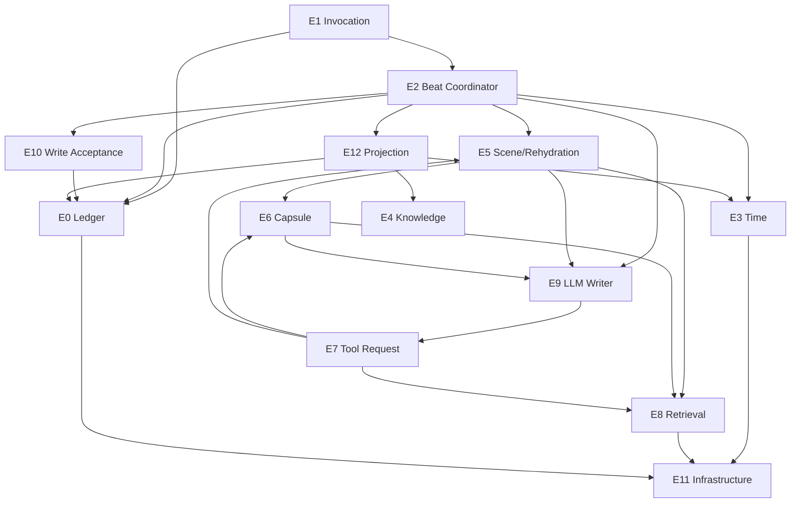

# ENGINE CALL GRAPH
STATUS: BINDING
AUTHORITY: PLAN.md (Phase 1.2)

This document defines the **single, unambiguous directed graph** of engine interactions.
Any implementation that violates this graph is invalid.

----------------------------------------------------------------------

## 1. GRAPH VISUALIZATION (TEXTUAL)

----------------------------------------------------------------------

## 2. ALLOWED CALLS (A → B)

### FROM ENGINE 1 (INVOCATION)
- **To Engine 0 (Ledger)**: To check idempotency (has this request_id been seen?).
- **To Engine 2 (Beat)**: To hand off a valid, new invocation for processing.

### FROM ENGINE 2 (BEAT COORDINATOR)
- **To Engine 3 (Time)**: To get the current world time for the beat.
- **To Engine 5 (Scene)**: To ensure scene context is fresh/rehydrated.
- **To Engine 9 (LLM)**: To solicit a write proposal (or silence).
- **To Engine 10 (Acceptance)**: To validate the proposal returned by E9.
- **To Engine 0 (Ledger)**: To commit the accepted bundle.
- **To Engine 12 (Projection)**: To render the final result of the beat.

### FROM ENGINE 3 (TIME)
- **To Engine 11 (Infra)**: To persist clock state.

### FROM ENGINE 4 (KNOWLEDGE)
- **None**: Engine 4 is a policy engine. It is called BY others (E12, E8) to get rules. It does not initiate calls.

### FROM ENGINE 5 (SCENE/REHYDRATION)
- **To Engine 8 (Retrieval)**: To fetch recent ledger entries for context.
- **To Engine 6 (Capsule)**: To fetch person-specific context for the scene.
- **To Engine 9 (LLM)**: To summarize context into a natural language anchor (if needed).

### FROM ENGINE 6 (CAPSULE)
- **To Engine 8 (Retrieval)**: To fetch evidence for capsule sections.
- **To Engine 9 (LLM)**: To summarize evidence into capsule sections (if needed).

### FROM ENGINE 7 (TOOL REQUEST)
- **To Engine 8 (Retrieval)**: To execute a `LEDGER_SEARCH` or `LEDGER_GET` tool.
- **To Engine 6 (Capsule)**: To execute a `CAPSULE_GET` tool.
- **To Engine 5 (Scene)**: To execute a `SCENE_PACK_BUILD` tool.

### FROM ENGINE 8 (RETRIEVAL)
- **To Engine 11 (Infra)**: To execute database or vector index queries.

### FROM ENGINE 9 (LLM WRITER)
- **To Engine 7 (Tool Request)**: To submit a `ToolRequest` when it needs more info.

### FROM ENGINE 10 (WRITE ACCEPTANCE)
- **To Engine 0 (Ledger)**: To check constraints (e.g. uniqueness) if validation requires state checks.

### FROM ENGINE 11 (INFRASTRUCTURE)
- **None**: It calls external services (Postgres, Redis), not other engines.

### FROM ENGINE 12 (PROJECTION)
- **To Engine 0 (Ledger)**: To read committed entries for rendering.
- **To Engine 3 (Time)**: To get the clock for the pocket view.
- **To Engine 4 (Knowledge)**: To get visibility rules for the viewer.

### FROM ENGINE 13 (POSTURE)
- **None**: Static analysis only.

### FROM ENGINE 14 (TEST)
- **To All Engines**: Test harness access.

----------------------------------------------------------------------

## 3. FORBIDDEN CALLS (A ✕→ B) - CRITICAL

### NO CYCLES
- **E9 (LLM) ✕→ E2 (Beat)**: The LLM cannot drive the beat.
- **E0 (Ledger) ✕→ E* (Any)**: Reality cannot invoke logic.

### NO BYPASSES
- **E9 (LLM) ✕→ E0 (Ledger)**: The LLM cannot write directly. It MUST go through E10.
- **E9 (LLM) ✕→ E8 (Retrieval)**: The LLM cannot read directly. It MUST go through E7.
- **E12 (Projection) ✕→ E9 (LLM)**: The UI cannot ask the LLM for content. It only shows what is written.

### NO TIME TRAVEL
- **E* ✕→ E3 (Time)**: No engine can *set* time except E3 itself (via E2's beat driver).

----------------------------------------------------------------------

## 4. RATIONALE

1. **Separation of Powers**: E9 (Intelligence) is isolated from E0 (Reality) by E10 (Law).
2. **Mechanical Pacing**: E2 (Beat) drives everything. Nothing happens outside a beat.
3. **Knowledge Safety**: E8 (Retrieval) and E12 (Projection) are the only readers, and they enforce E4 (Knowledge) rules.
4. **Idempotency**: E1 (Invocation) protects the system from duplicate execution.

